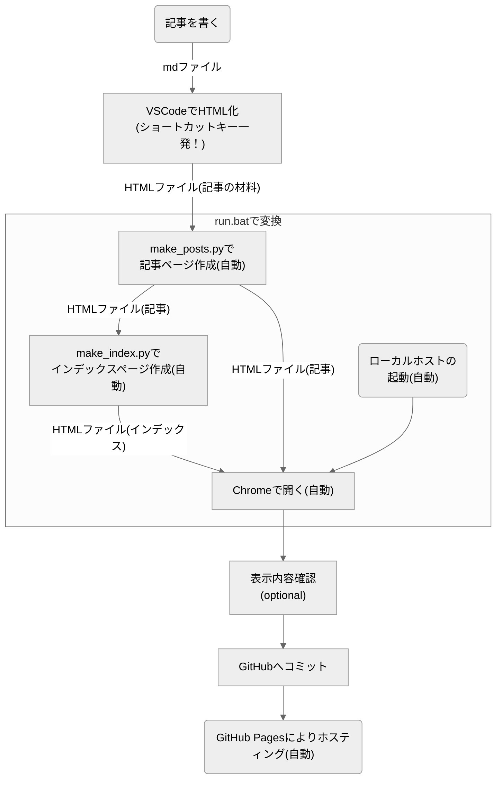

# GitHub Pagesでブログ制作してみた

---

GitHub Pagesで無料個人ブログを作ってみました！  
1つ目の記事は、このブログの実装についてです。個々の機能については追々[Web制作関連の記事](../#Web制作)でアップしていきます！  
PythonとHTMLにある程度なじみのある方であれば類似目的に流用できそうとおもうので、使えそうだったらぜひ流用してください～  

## このブログの実装面の特徴
### 方式の概要
ホスティングとかサーバーとかは全部[GitHub Pages](https://docs.github.com/ja/pages/getting-started-with-github-pages/about-github-pages)に任せていて、ページの中身だけいじればOKの状態になっています。  
記事をHTMLとして成形する部分と、記事をタグでまとめたりする部分は、VSCodeの拡張機能とPythonスクリプトの力を借りてローカルで処理しています。   
静的サイトなので、動的サイト（WordPressとかで作ったサイト）よりも幾分動作が速いかもしれません。

### この方式のメリット
個人的なお気に入りポイントが4つあります。
- サーバーレンタルとかドメイン取得とかしていないので管理が楽

- Markdownで記事書いてから、ちょいちょいと操作すれば記事を投稿できる
- 維持費無料
- 広告収入得られる（はず。貼れば）

### 実装した機能
ブログとして必要最低限（？）の機能を実装しました。
- 記事のタグ管理

- コードブロック＆コピーボタン
- mermaidでの作図 : VSCodeの拡張機能をリバースエンジニアリングしました...笑
- 画像の表示
- 3Dモデルの表示 : three.jsを使ってます
- SNSへのリンク（ウィンドウサイズに応じてハンバーガーメニュー化）
- かわいいアイコン

### 投稿時の操作
ちょいちょいっとクリックしたりキーを押すだけです。書くのを含めて5ステップ！  
さらにめんどくさがりの人は、以下のようにすれば3ステップになります。
- 表示内容確認を飛ばす

- GitHubへコミットする操作をmake_html.batに書く

※ **[トップページ](../)も含めて自動で更新**される仕組みです。

## この方式にした経緯
無料でWebページを公開する方法を調べる中で[GitHub Pages](https://docs.github.com/ja/pages/getting-started-with-github-pages/about-github-pages)なるものがあるということを知りました。（2年前）  
その後2年ほど、なんだか忙しくなって作りかけのコードを放置していましたが、少し時間ができたので再度ブログにチャレンジしようと思い再び重い腰を上げました。  
  
以前作りかけたコードを開き、、、そっ閉じし、楽に書く方法を探した末に[Jekyll](https://jekyllrb-ja.github.io/)なるものを知りました。  
Jekyllの特徴をChatGPTに聞くと以下のように返ってきます。
- 静的サイトジェネレーター
    - Jekyllは静的サイトを生成するためのジェネレーターであり、動的なデータベースやサーバーサイド言語を必要とせず、プレーンなHTML、CSS、JavaScriptファイルを生成します。  

- Markdownサポート
    - Markdown形式でコンテンツを書き、それをHTMLに変換してサイトに組み込むことができます。
    - これにより、コンテンツの管理が簡素化されます。
- テンプレートエンジン
    - Liquidと呼ばれる柔軟なテンプレートエンジンを使用して、再利用可能なテンプレートを作成し、サイトの外観や構造をカスタマイズすることができます。
- GitHub Pagesとの統合
    - JekyllはGitHub Pagesにネイティブに統合されており、リポジトリ内のJekyllサイトをホストすることができます。
    - これにより、簡単に無料のホスティングとバージョン管理を利用できます。
- プラグインのサポート
    - Jekyllはプラグインアーキテクチャを備えており、機能の拡張が可能です。
    - プラグインを使用することで、自動化やカスタマイズが容易になります。
- シンプルなディレクトリ構造
    - Jekyllのディレクトリ構造はシンプルで直感的であり、新しいプロジェクトのセットアップや管理が容易です。
- 高速なパフォーマンス
    - Jekyllが生成するサイトは静的であるため、高速なパフォーマンスを提供します。
    - サーバーに負荷をかけることなく、高いスケーラビリティを実現します。

よさそう！　ということで使ってみようとしましたが、自分には合いませんでした。  
最終的には以下の理由でJekyll使うのやめて、今の方式にしました。  

- 後々細かいカスタマイズしたくなったときにめんどくさそう
    - 色々しようとすると色んなタイミングで表示崩れが起きるしデバッグしにくかった(漠然)

- 個人的には、ほぼMarkdownサポートしかメリット感じない
    - Markdownサポートに関しては、batファイルを作っておいて記事投稿する前にローカルで実行すればいいじゃん
    - ローカルでスクレイピングをやるような感じですぐスクリプト書けそう
    - 自分で書いたコードの方が改良しやすそう

Jekyllの他にも似たようなのがあるようですが、代替手段思いついたので特に調べてません。（清々しい表情）

## まとめ
このサイトの実装についてざっくり紹介しました。

- GitHub Pagesに裏方は全部任せて、表示用のファイルだけ編集すればOK

- 記事のタグ管理とかはローカルで処理している
- mermaidでの作図や3Dモデルの表示、かわいいアイコンなどといった最低限の機能を実装している
- Jekyllは挫折しました

PythonとHTMLにある程度なじみのある方であれば類似目的に流用できそうと思っています。  
Pythonスクリプトとstyle.cssは殴り書き状態なので、追々きれいにしようと思います。  
使えそうなところあったらぜひ流用してください～  
個々の機能については追々[Web制作関連の記事](../#Web制作)でアップしていきます！  
