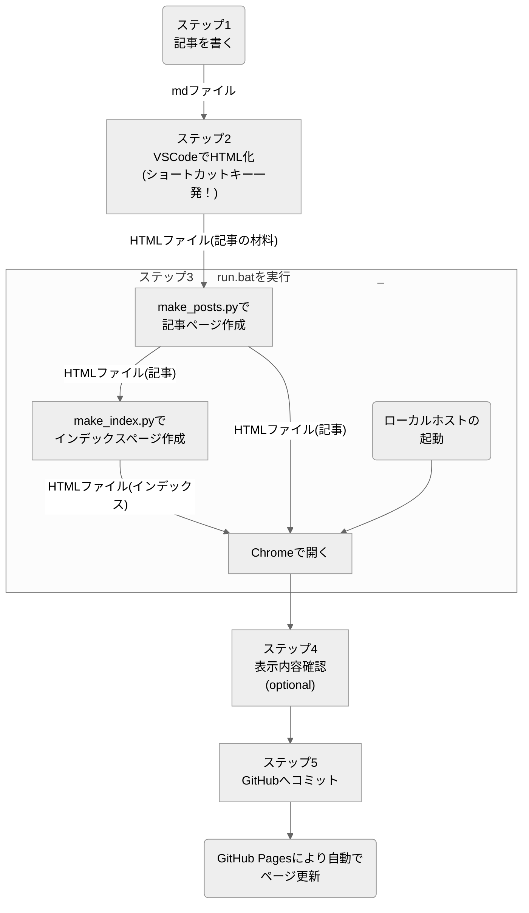

# GitHub Pagesでブログ作った。投稿時の処理の自動化とかもした

---

GitHub Pagesで無料個人ブログを作ってみました！  
この記事では、このブログサイトの仕組みやメリットについて大まかに紹介します。  
具体的な個々の機能については追々[Web制作関連の記事](../#Web制作)でアップしていきます！  
コードは[GitHub](https://github.com/hitbug0)に置いてあるので、使えそうだったらぜひ流用してください～  

## この記事でわかること
このブログサイトの仕組みと、そのメリットがわかります。
- 裏方をGitHub Pagesに全部任せており、表示用のファイルだけを編集すればよい感じになっているので、無料だし維持管理が楽

- 記事はmarkdown形式で書けばOK。表示のスタイルはテンプレートに従って自動で整うようになっている
- 記事内で図の描画(mermaid)や画像/3D形状の表示が可能
    - 画像や3D形状を記事内に表示したい場合も、markdown形式のテキストで指定できる
- 投稿時の処理もほぼ自動化できているので楽
    - ローカルでのPythonスクリプト実行 + VSCode拡張機能　を利用
- ソースコードは[GitHub](https://github.com/hitbug0)に置いてあるので誰でもパクれる

## このブログサイトってどんなふうに実装されてる？
ホスティングとかは全部[GitHub Pages](https://docs.github.com/ja/pages/getting-started-with-github-pages/about-github-pages)に任せていて、ページの中身だけいじればいいようになっています。  
記事をHTMLとして整形する部分と、記事をタグでまとめたりする部分は、VSCodeの拡張機能とPythonスクリプトの力を借りてローカルで処理しています。   
静的サイトなので、動的サイト（WordPressとかで作ったサイト）よりも幾分動作が速いかもしれません。

## この実装方式のメリットは？
個人的なお気に入りポイントが4つあります。
- サーバーレンタルとかドメイン取得とかしていないので管理が楽

- Markdownで記事書いてから、ちょいちょいと操作すれば記事を投稿できる
- 維持費無料
- 広告収入得られる（はず。貼れば）

## ブログサイトに実装した表示機能は？
ブログとして必要最低限（？）の機能を実装しました。  
個々の機能については追々[Web制作関連の記事](../#Web制作)でアップしていきます！  

- 記事のタグ管理

- コードブロック＆コピーボタン
- mermaidでの作図 : VSCodeの拡張機能を ~~リバースエンジニアリングしました~~ 参考にしました！
- 画像の表示
- 3Dモデルの表示 : three.jsを使ってます
- SNS投稿の埋め込み : 埋め込みコードをmarkdownファイルに貼るだけでOK
- SNSへのリンク（ウィンドウサイズに応じてハンバーガーメニュー化）
- かわいいアイコン

## 記事投稿の操作大変じゃないの？→楽です
上で書いた表示機能を全部いちいちHTMLで書くのは骨が折れるし、サイトマップ登録とかもポチポチやっていくのが面倒...  
というわけで、Pythonのスクリプトで主に以下3つの機能を自動化しました。  
個々のコードについては追々[Web制作関連の記事](../#Web制作)でアップしていきます！ 

1. **記事ファイルの形式変換**（markdown → HTML)
    - コードブロックへコピーボタンを自動追加
    - 画像や3D形状の情報をHTMLで読めるコードに変換
    - 以下についてはVSCode拡張機能を利用

        - mermaidのコードを図に変換
        - コードブロックの言語を指定し、シンタックスハイライトを追加

2. **記事リストページへの記事情報の反映**
    - 記事情報を表データにする

    - 表データをもとに、タグごとに記事情報（日付、タイトル、イントロ、タグ）を並べる

3. **サイトマップの作成と自動登録**
    - XMLサイトマップを作成する

    - Google Search Consoleにサイトマップを登録する

### 操作手順
自動化した結果、投稿時の処理がすごく楽になりました。
ちょいちょいっとクリックしたりキーを押すだけです。書くのを含めて5ステップ！  
さらにめんどくさがりの人は、以下のようにすれば3ステップになります。
- 表示内容確認を飛ばす

- GitHubへコミットする操作をmake_html.batに書く

※ **[トップページ](../)も含めて自動で更新**される仕組みです。

## なんでこんな方式にしたの？
### GitHub Pagesが超便利
無料でWebページを公開する方法を調べる中で[GitHub Pages](https://docs.github.com/ja/pages/getting-started-with-github-pages/about-github-pages)なるものがあるということを知りました。（2年前）  
その後2年ほど、なんだか忙しくなって作りかけのコードを放置していましたが、少し時間ができたので再度ブログにチャレンジしようと思い再び重い腰を上げました。  

### Jekyll挫折した
以前作りかけたコードを開き、、、そっ閉じし、楽に書く方法を探した末に[Jekyll](https://jekyllrb-ja.github.io/)なるものを知りました。  
Jekyllの特徴をChatGPTに聞くと以下のように返ってきます。
- 静的サイトジェネレーター
    - Jekyllは静的サイトを生成するためのジェネレーターであり、動的なデータベースやサーバーサイド言語を必要とせず、プレーンなHTML、CSS、JavaScriptファイルを生成します。  

- Markdownサポート
    - Markdown形式でコンテンツを書き、それをHTMLに変換してサイトに組み込むことができます。
    - これにより、コンテンツの管理が簡素化されます。
- テンプレートエンジン
    - Liquidと呼ばれる柔軟なテンプレートエンジンを使用して、再利用可能なテンプレートを作成し、サイトの外観や構造をカスタマイズすることができます。
- GitHub Pagesとの統合
    - JekyllはGitHub Pagesにネイティブに統合されており、リポジトリ内のJekyllサイトをホストすることができます。
    - これにより、簡単に無料のホスティングとバージョン管理を利用できます。
- プラグインのサポート
    - Jekyllはプラグインアーキテクチャを備えており、機能の拡張が可能です。
    - プラグインを使用することで、自動化やカスタマイズが容易になります。
- シンプルなディレクトリ構造
    - Jekyllのディレクトリ構造はシンプルで直感的であり、新しいプロジェクトのセットアップや管理が容易です。
- 高速なパフォーマンス
    - Jekyllが生成するサイトは静的であるため、高速なパフォーマンスを提供します。
    - サーバーに負荷をかけることなく、高いスケーラビリティを実現します。

よさそう！　ということで使ってみようとしましたが、自分には合いませんでした。  

- 後々細かいカスタマイズしたくなったときにめんどくさそう
    - 色々しようとすると色んなタイミングで表示崩れが起きるしデバッグしにくかった(漠然)

- 個人的には、ほぼMarkdownサポートしかメリット感じない
    - Markdownサポートに関しては、batファイルを作っておいて記事投稿する前にローカルで実行すればいいじゃん
    - ローカルでスクレイピングをやるような感じですぐスクリプト書けそう
    - 自分で書いたコードの方が改良しやすそう

というわけで今の方式にしました。  
Jekyllの他にも似たようなのがあるようですが、代替手段思いついたので特に調べてません。（清々しい表情）

## まとめ
このブログサイトの仕組みやメリットについて大まかに紹介しました。  

- 裏方をGitHub Pagesに全部任せており、表示用のファイルだけを編集すればよい感じになっているので、無料だし維持管理が楽

- 記事はmarkdown形式で書けばOK。テンプレートに従って表示のスタイルは自動で整うようになっている。
- 記事内で図の描画(mermaid)や画像/3D形状の表示が可能
    - 画像や3D形状を記事内に表示したい場合も、markdown形式のテキストで指定できる
- 投稿時の処理もほぼ自動化できているので楽
    - ローカルでのPythonスクリプト実行 + VSCode拡張機能　を利用
- ソースコードは[GitHub](https://github.com/hitbug0)に置いてあるので誰でもパクれる

具体的な個々の機能については追々[Web制作関連の記事](../#Web制作)でアップしていきます！  
コードは[GitHub](https://github.com/hitbug0)に置いてあるので、使えそうだったらぜひ流用してください～  
（style.cssは殴り書き状態なので、追々きれいにしようと思います...）  
