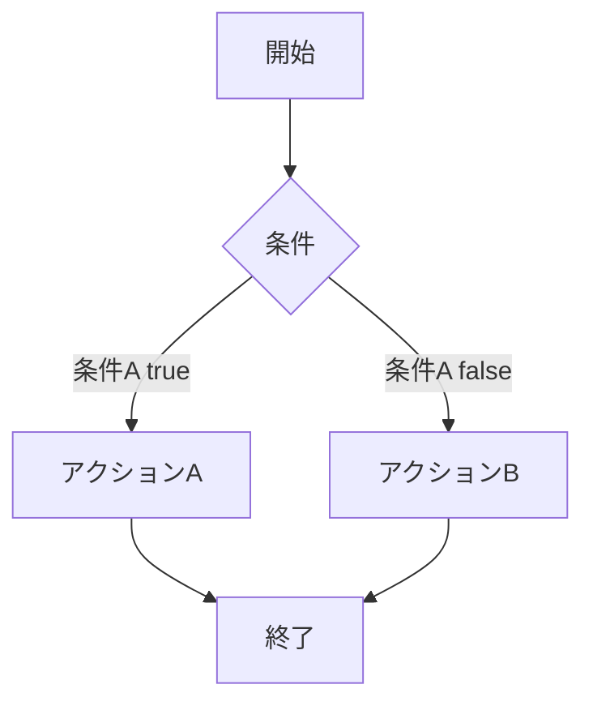
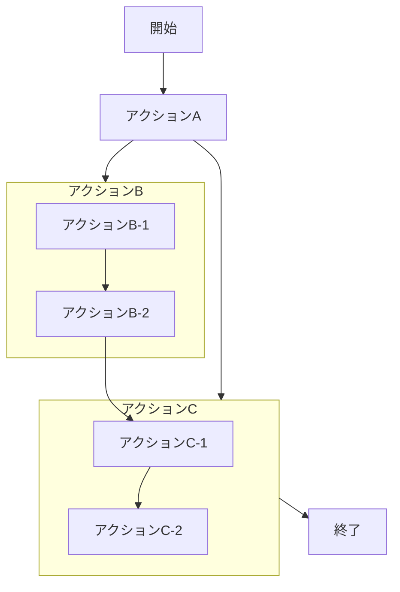
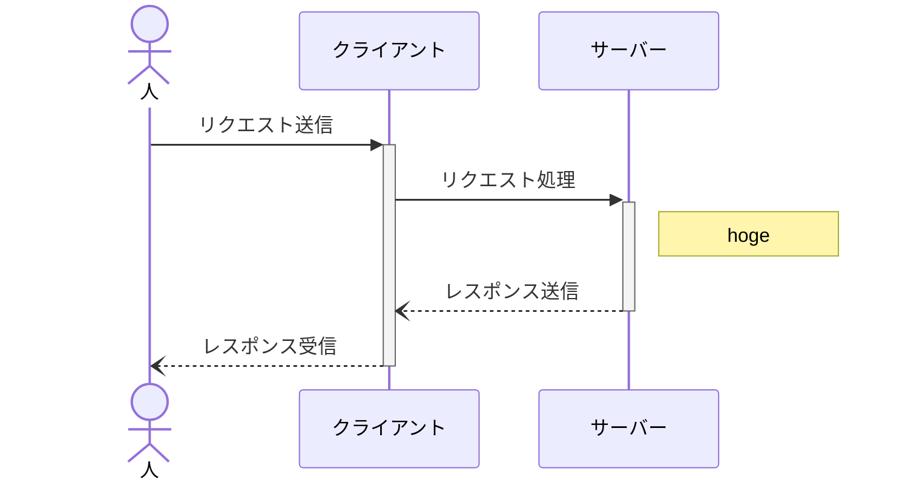
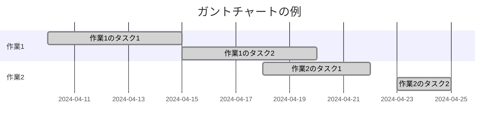
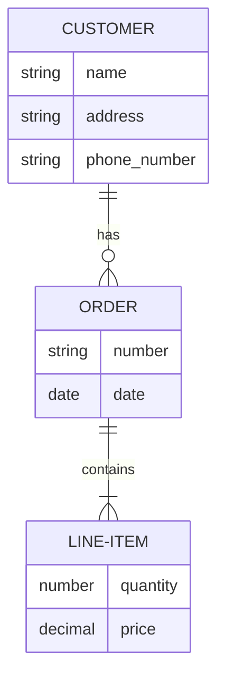
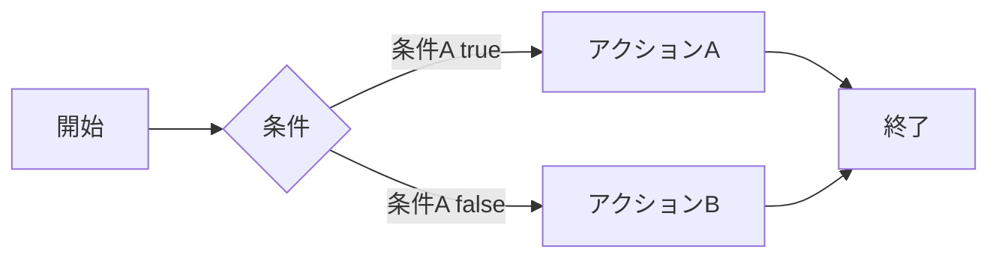
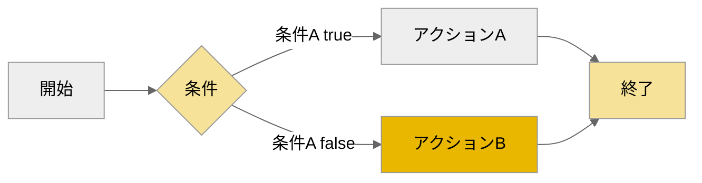

# 【mermaid】markdownのドキュメントに図を描く方法
[](::tags::mermaid,markdown,VSCode)

---

markdownファイル内にテキストで図を描く方法についての記事です。  
図はmermaidという記法を使って作成します。  
HTML形式で出力もできて、結構便利で私は仕事で使ったりもしています。

## mermaidとは
mermaidは、テキストで図や表を描画するためのツールです。
以下のような特徴があります。
- シンプルな記法
    - mermaidの記法はシンプルで直感的
    - 専門的なグラフィックススキルがなくても誰でも使い始められる

- プレーンテキスト形式
    - 通常のテキストエディタで編集できるため、互換性が高い
    - バージョン管理がしやすい
- 様々な種類の図が描ける
    - フローチャート、シーケンス図、ガントチャート、ER図、などなど
    - 色を変えたいなどの場合そのコマンドを記入する
- 自動レイアウト
    - 自動的に図のレイアウトを調整してくれる
    - 手動でレイアウトを調整する手間が省け、表現したい内容に集中できる
- 無料

## 基本的な図の書き方
シンプルな図とその元となるテキストを書いていきます。  
これらのほかにもカスタマージャーニーズをかけた気がします。

### フローチャート
入れ子になっていても大丈夫です。  
また、`graph`の後を`LR`や`TB`にすることで、フローの向きを変えることもできます。  

```Python
graph TD;
    A[開始] --> B{条件};
    B -->|条件A true| C[アクションA];
    B -->|条件A false| D[アクションB];
    C --> E[終了];
    D --> E;
```

```Python
graph TD;
    A[開始] --> B[アクションA];
    B --> C;
    B --> D;
    D --> E[終了];
    subgraph D[アクションC]
        アクションC-1--> アクションC-2;
    end
    subgraph C[アクションB]
        アクションB-1--> アクションB-2;
    end
    アクションB-2--> アクションC-1;
```
### シーケンス図
`note`でコメントを記入できるほか、矢印の形や、実行状態かどうかなども表現できます。

```Python
sequenceDiagram
    actor 人
    participant クライアント
    participant サーバー
    人 ->>+ クライアント: リクエスト送信
    クライアント ->>+ サーバー: リクエスト処理
    note right of サーバー: hoge
    サーバー --)- クライアント: レスポンス送信
    クライアント --)- 人: レスポンス受信
```
### ガントチャート

```Python
gantt
    title ガントチャートの例
    dateFormat  YYYY-MM-DD
    section 作業1
    作業1のタスク1 :done, 2024-04-10, 2024-04-15
    作業1のタスク2 :done, 2024-04-15, 2024-04-20
    section 作業2
    作業2のタスク1 :done, 2024-04-18, 2024-04-22
    作業2のタスク2 :done, 2024-04-23, 2024-04-25
```

### ER図

```Python
erDiagram
    CUSTOMER ||--o{ ORDER : has
    ORDER ||--|{ LINE-ITEM : contains
    CUSTOMER {
        string name
        string address
        string phone_number
    }
    ORDER {
        string number
        date    date
    }
    LINE-ITEM {
        number quantity
        decimal price
    }

```

## 色の変更方法
こんな感じでテーマの色や図形の色を変えることができます。  
もちろん
もっと詳しく知りたい方は、[junkawaさんのページ](https://zenn.dev/junkawa/articles/zenn-mermaidjs-theme-config)をはじめ様々なサイトで紹介されてますので、色々見てみてください～

### 変更前

```Python
graph LR;
    A[開始] --> B{条件};
    B -->|条件A true| C[アクションA];
    B -->|条件A false| D[アクションB];
    C --> E[終了];
    D --> E;
```
### 変更後

```Python
%%{init: {'theme':'neutral'}}%%
graph LR;
    classDef c1 fill:#eab700,fill-opacity:0.4
    classDef c2 fill:#eab700,fill-opacity:1
    A[開始] --> B{条件}:::c1;
    B -->|条件A true| C[アクションA];
    B -->|条件A false| D[アクションB]:::c2;
    C --> E[終了]:::c1;
    D --> E;
```

## VSCodeでMarkdownに図を入れる具体的な方法
[VSCodeでMarkdownをHTML化する方法](../posts/2024-04-19-markdown2html.html)に記載の初期設定と操作方法で、プレビューと出力ができると思います。

## まとめ
markdownファイル内にテキストで図を描くためのmermaidという記法について紹介しました。  
シンプルな記法で色々作図できますし、VSCodeを使えば図が組み込まれたmarkdownドキュメントをHTML形式で出力できます！  
結構便利で私は仕事で使ったりもしているので、是非使ってみてください～

