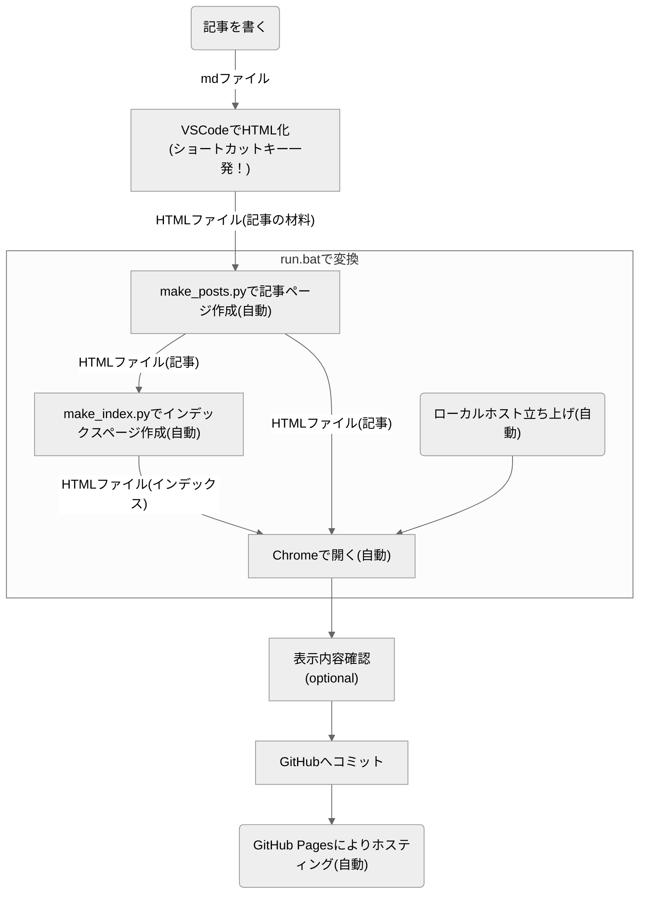

# GitHub Pagesでブログ制作　その1　このブログの実装について

---

GitHub Pagesで無料個人ブログを作ってみました！  
それなりに拡張性もあるような気がするので、PythonとHTMLにある程度なじみのある方であれば類似目的に流用できそうとおもっています。  
1つ目の記事は、このブログの実装の紹介です。

## このブログの仕組みとしての特徴
### サイト運営上の特徴
いいことしかないです！（諸説あります）
- 維持費無料！
- 広告収入得られる！（はず！貼れば！）
- めんどくさいサーバーレンタルとかドメイン取得とかしてない！
- Markdownで記事書いてから、ちょいちょいと操作すれば記事を投稿できる！
- Jekyllとか使ってない

### 機能
必要最低限！（？）
- 記事のタグ管理
- コードブロック＆コピーボタン
- mermaidでの作図
- 3Dモデルの表示
- SNSへのリンク（ウィンドウサイズに応じてハンバーガーメニュー化）
- かわいいアイコン

### 投稿時の操作
ちょいちょいっとクリックしたりキーを押すだけです！　書くの含めて5ステップ！  
さらにめんどくさがりの人は、以下のようにすれば3ステップになります
- 表示内容確認を飛ばす
- GitHubへコミットする操作をmake_html.batに書く

※ **トップページも含めて自動で更新**される仕組みです。

## どんな実装？（もう少し具体的に）
### ホスティング
ホスティングに関してはGitHubにコードをコミットすること以外してません。GitHub Pages様様！  
GitHub Pagesの使い方はこのサイトとかご参考ください！

### ファイル構成
ファイルの中身はGitHubでご覧ください～

- **.git** : Gitリポジトリ
- **_posts_original** : VSCodeで作成/編集したmdファイルと、そこから変換されたHTMLファイルが入っている
- **_programs** : ローカルで回すスクリプトが入っている
    - **make_posts.py** : 記事を作る
    - **make_index.py** : インデックスページとタグ表示要素を作る
- **_templates** : サイト用HTMLファイルのテンプレートが入っている
    - **index_template.html**
    - **post_template.html**
    - **tags_template.html**
- **posts** : 記事ページのHTMLファイルが入っている
    - **yyyy-mm-dd-filename.html** : 記事ページのHTMLファイル。スクリプト実行すると、_posts_originalの中のHTMLファイルから自動で作成される。
- **includes** : インクルードファイルが入っている
    - **icon** : かわいいアイコン画像が入っている
    - **footer.html** : フッタのHTMLファイル
    - **header.html** : ヘッダのHTMLファイル
    - **hamburger-menu.html** : ウィンドウ幅が狭いときのハンバーガーメニューのHTMLファイル
    - **tags.html** : インデックスページ用のタグ表示要素。スクリプト実行により記事の内容が反映される
    - **tags-post.html** : 記事ページ用のタグ表示要素。スクリプト実行により記事の内容が反映される
    - **style.css** : スタイル
    - **clipboard-script.js** : コピー機能のスクリプト
    - **disp_3dmodel.js** : 3Dモデル表示のスクリプト
    - **hamburger-menu-trigger.js** : ハンバーガーメニューの動作のスクリプト

- **README.md** : GitHub用のドキュメント。ほぼ書いてない
- **run.bat** : サイト用のHTMLファイルを作成し、ローカルでサイトを開くファイル
- **make_html.bat** : _programsフォルダのスクリプトを実行するためのファイル
- **manifest.json** : アプリとしてのメタデータを定義するファイル
- **index.html** : インデックスページのHTMLファイル。スクリプト実行により記事の内容が反映される

## なんでこんな風にしたの？
### そもそもの動機
動機は主に以下の4点です。動機の符号は問わないものとします。
- 技術ブログやってみたい ~~。書くことあんまりないけど~~
- 広告収入ほしい
- めんどくさいサーバーの手続きとかかしたくない
- 維持費無料がいい

### 経緯
色々調べると、[GitHub Pages]()なるものがあるということが分かり、これを使うと無料でWebページが公開できることを知りました。（2年前）  
その後2年ほど、なんだか忙しくなって放置していましたが、少し時間ができたので再度ブログにチャレンジしようと思い再び重い腰を上げました。  
  
以前作りかけたコードを開き、、、そっ閉じし、楽に書く方法を探した末に[Jekyll]()なるものを知りました。  
Jekyllの特徴をChatGPTに聞くと以下のように返ってきます。
- 静的サイトジェネレーター
    - Jekyllは静的サイトを生成するためのジェネレーターであり、動的なデータベースやサーバーサイド言語を必要とせず、プレーンなHTML、CSS、JavaScriptファイルを生成します。  
- Markdownサポート
    - Markdown形式でコンテンツを書き、それをHTMLに変換してサイトに組み込むことができます。
    - これにより、コンテンツの管理が簡素化されます。
- テンプレートエンジン
    - Liquidと呼ばれる柔軟なテンプレートエンジンを使用して、再利用可能なテンプレートを作成し、サイトの外観や構造をカスタマイズすることができます。
- GitHub Pagesとの統合
    - JekyllはGitHub Pagesにネイティブに統合されており、リポジトリ内のJekyllサイトをホストすることができます。
    - これにより、簡単に無料のホスティングとバージョン管理を利用できます。
- プラグインのサポート
    - Jekyllはプラグインアーキテクチャを備えており、機能の拡張が可能です。
    - プラグインを使用することで、自動化やカスタマイズが容易になります。
- シンプルなディレクトリ構造
    - Jekyllのディレクトリ構造はシンプルで直感的であり、新しいプロジェクトのセットアップや管理が容易です。
- 高速なパフォーマンス
    - Jekyllが生成するサイトは静的であるため、高速なパフォーマンスを提供します。
    - サーバーに負荷をかけることなく、高いスケーラビリティを実現します。

**Markdownサポートが便利そう**ということで使ってみようとしましたが、自分には合いませんでした。  
最終的には以下の理由でJekyll使うのやめて、**VSCodeの拡張機能とPythonスクリプトを使ってMarkdownからHTMLへ自動で変換**することにしました。  
Jekyllの他にも似たようなのがあるようですが、折角代替手段思いついたし特に調べてません。

- 後々細かいカスタマイズしたくなったときにめんどくさそう
    - 色々しようとすると色んなタイミングで表示崩れが起きるしデバッグしにくかった
- 個人的には、ほぼMarkdownサポートしかメリット感じない
    - Markdownサポートに関しては、batファイルを作っておいて記事投稿する前にローカルで実行すればよくね？
    - ローカルでスクレイピングをやるような感じですぐスクリプト書けそう
