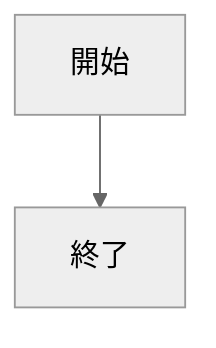

# GitHub Pagesでブログ制作 その1 画面構成
[](::tags::GitHubPages,HTML,CSS,JavaScript,個人ブログ制作)

---

GitHub Pagesで無料個人ブログを作ってみました！  
2つ目の記事は、基本となる画面設計とその実装についてです。  
このブログで実装した機能については

## はじめに
### GitHub Pages
[URL](./2024-04-10-GitHub-Pagesでブログ制作-その0-実装した機能概要.html)
### Jekyll

## 画面設計
### qiita
### XXX
### 今回のページ

## 実装
### ファイル構成
### index.html
```Python
import os
fuga = [2 * k * 333333333333333333333333333333333333333333333333333333333333333333333333333333333333333333333333 * 3333333333333333333333333333333333333333333333333333 for k in klist]

def func(arg):
    return arg
```
### post.html
### style.css

## mermaid 


