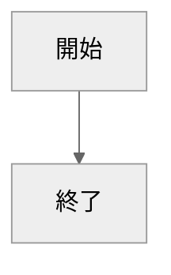

# デバッグ用1
[](::tags::Python,機械学習)

---

表示確認用のページです


## h2
- 1
    - 2
        - 3

### h3
1. いち
1. に
1. さん333333333333333333
33333333333333333333333333333333333333333333333333333333333333333333333333333333333333333333333333
3333333333333333333333333333333333333333333333333333

## code
`hoge`と`huga`  
**ボールド**, *斜体*, ~~取り消し線~~  
[URL](https://hitbug0.github.io/posts/2024-04-10-%E3%83%87%E3%83%90%E3%83%83%E3%82%B0%E7%94%A81.html)


```C#
bool sampleFlag = false;
string sampleString = "Sample";
```
```Python
import os
fuga = [2 * k * 333333333333333333333333333333333333333333333333333333333333333333333333333333333333333333333333 * 3333333333333333333333333333333333333333333333333333 for k in klist]

def func(arg):
    return arg


```

## mermaid 


## 画像
::img{
    file{
        1.jpg: one;
    }
    height: 200px;
}::
::img{
    file{
        1.jpg: one;
        2.jpg: two;
        3.jpg: three;
    }
    height: 120px;
}::

## 3Dモデル
::stl{
    file: milk_crown.stl;
    camera: [0,-300,150];
    color: orange;
}::
::stl{
    file: chain.stl;
    camera: [0,-300,150];
    color: orange;
}::
::stl{
    file: milk_crown.stl;
    camera: [0,300,150];
    color: rainbow;
}::
