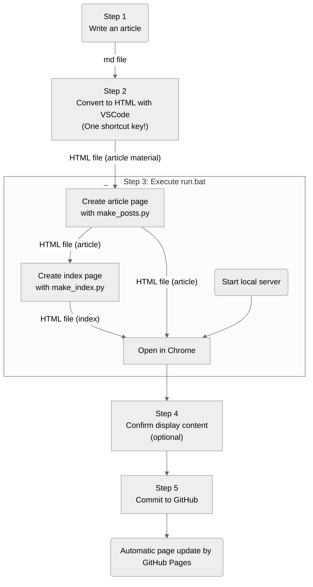

# Created a Blog with GitHub Pages: Automated Posting Process
::tags{Web Development, GitHub Pages}::

---

I made a free personal blog using GitHub Pages!  
In this article, I'll give an overview of the structure and benefits of this blog site.  
The code is available on [my GitHub page](https://github.com/hitbug0), so feel free to use it if you find it helpful.

## What You'll Learn
You'll understand the structure of this blog site and its benefits.
- All backend tasks are handled by GitHub Pages, so you only need to edit the display files, making it free and easy to maintain.

- You can write articles in markdown format. The display style is automatically arranged according to the template.
- You can include diagrams (mermaid), images, and 3D shapes in your articles.
    - Even if you want to display images or 3D shapes in the articles, you can specify them in markdown text.
- The posting process is almost fully automated, making it easy.
    - Using a Python script locally + VSCode extensions
- The source code is available on [my GitHub page](https://github.com/hitbug0).

## How This Blog Site Works
All hosting is handled by [GitHub Pages](https://docs.github.com/en/pages/getting-started-with-github-pages/about-github-pages), so you only need to tweak the content of the pages.  
The parts that format the articles as HTML and group them by tags are processed locally with VSCode extensions and Python scripts.  
Since it's a static site, it may run a bit faster than dynamic sites (like those made with WordPress).

## Benefits of This System
Here are my four favorite points.
- No need to rent a server or acquire a domain, making it easy to manage.

- You can write articles in Markdown and publish them with a few simple steps.
- No maintenance costs.
- You can earn ad revenue (potentially, if you add ads).

## Implemented Display Features
I've implemented the minimum (or maybe more) features necessary for a blog.  
I'll upload specific details about each feature in related [web development articles](../index-en.html#Web-Development) as I go along!

- Tag management for articles
- Code blocks & copy button
- Diagram creation with mermaid: ~Reverse engineered~ Referenced VSCode extensions!
- Image display
- 3D model display: Using three.js
- Embedded SNS posts: Just paste the embed code into the markdown file
- Links to SNS (turns into a hamburger menu depending on window size)
- Cute icons

## Streamlining (Semi-Automating) Article Posting
Manually writing all the display features in HTML and registering the sitemap can be tedious...  
So, I automated the following three main functions with Python scripts.  

1. **Converting article files** (Markdown → HTML)
    - Automatically adds copy buttons to code blocks
    - Converts image and 3D shape information to HTML-readable code
    - Uses VSCode extensions for the following:
        - Converts mermaid code to diagrams
        - Specifies the language of code blocks and adds syntax highlighting

2. **Reflecting article information on the article list page**
    - Turns article information into tabular data
    - Based on the tabular data, arranges article information (date, title, intro, tags) by tags

3. **Creating and automatically registering the sitemap**
    - Creates an XML sitemap
    - Registers the sitemap with Google Search Console

### Operation Procedure
Thanks to automation, the posting process has become much easier.
A few clicks or keystrokes, and it's done. Just 5 steps, including writing!  
For those who want it even simpler, you can reduce it to 3 steps by:
- Skipping the display content confirmation
- Writing the commit to GitHub operation into make_html.bat

※ **The homepage of this site is automatically updated as well.**

## Why I Implemented This System
### GitHub Pages is Super Convenient
While researching ways to publish web pages for free, I learned about [GitHub Pages](https://docs.github.com/en/pages/getting-started-with-github-pages/about-github-pages) (two years ago).  
After being busy and leaving my code unfinished for about two years, I finally had some time and decided to give blogging another shot.

### I Gave Up on Jekyll
I reopened my unfinished code, quickly closed it, and looked for an easier way, eventually discovering [Jekyll](https://jekyllrb.com/).  
According to ChatGPT, here are Jekyll's features:
- Static site generator
    - Jekyll is a generator for static sites, creating plain HTML, CSS, and JavaScript files without needing dynamic databases or server-side languages.
- Markdown support
    - You can write content in Markdown format, which is then converted to HTML and integrated into your site, simplifying content management.
- Template engine
    - Uses a flexible template engine called Liquid to create reusable templates and customize the site's appearance and structure.
- Integration with GitHub Pages
    - Jekyll is natively integrated with GitHub Pages, allowing you to host Jekyll sites in your repository, making it easy to utilize free hosting and version control.
- Plugin support
    - Jekyll has a plugin architecture, enabling easy automation and customization.
- Simple directory structure
    - Jekyll's directory structure is simple and intuitive, making it easy to set up and manage new projects.
- High performance
    - Jekyll generates static sites, providing high performance without server load and offering high scalability.

Sounds great! But when I tried it, it didn't work for me.

- Customizing it later seemed like a hassle.
    - Various display issues occurred at different times, making it difficult to debug (vaguely).
- Personally, I only felt the benefit of Markdown support.
    - For Markdown support, I thought it would be better to create a bat file and run it locally before posting articles.
    - It seemed easy to write a script for local scraping.
    - I thought it would be easier to improve the code I wrote myself.

So, I went with the current method.  
There seem to be other similar options besides Jekyll, but I came up with an alternative, so I didn't research them further.

## Conclusion
I provided an overview of the structure and benefits of this blog site.

- All backend tasks are handled by GitHub Pages, so you only need to edit the display files, making it free and easy to maintain.

- You can write articles in markdown format, and the display style is automatically arranged according to the template.
- You can include diagrams (mermaid), images, and 3D shapes in your articles.
    - Even if you want to display images or 3D shapes in the articles, you can specify them in markdown text.
- The posting process is almost fully automated, making it easy.
    - Using a Python script locally + VSCode extensions

I'll upload specific details about each feature in related [web development articles](../index-en.html#Web-Development) as I go along!  
The code is available on [my GitHub page](https://github.com/hitbug0), so feel free to use it if you find it helpful.  
(style.css is currently a bit messy, but I'll clean it up eventually...)