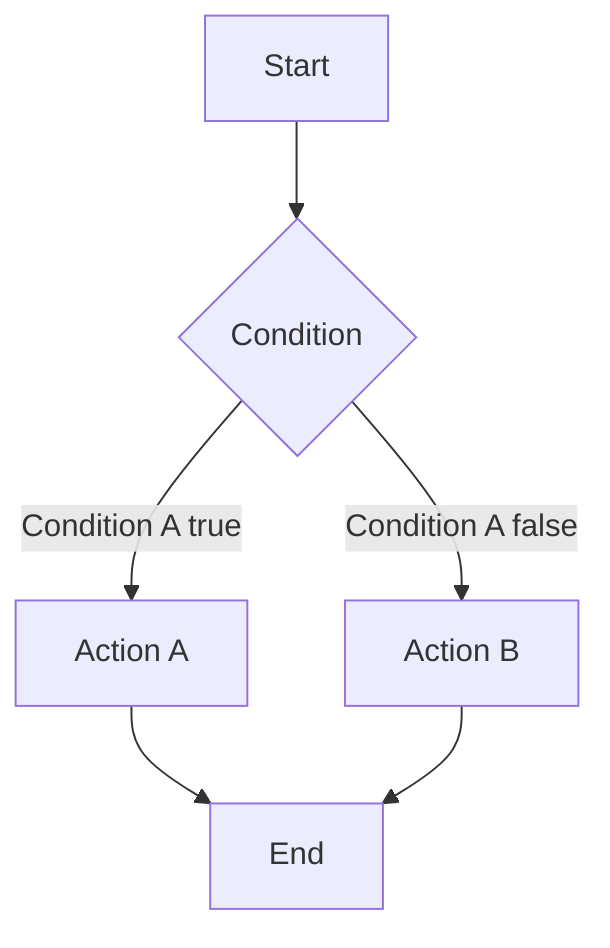
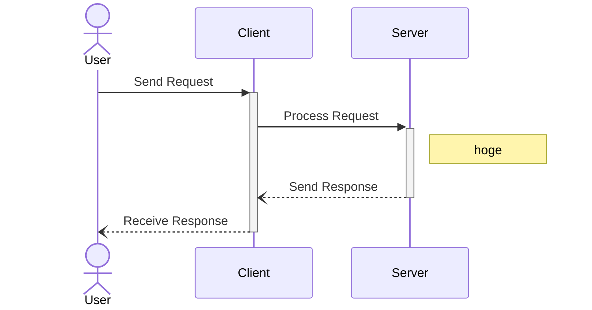
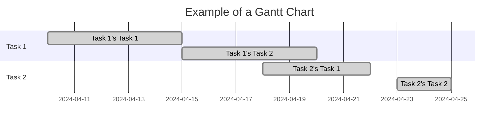
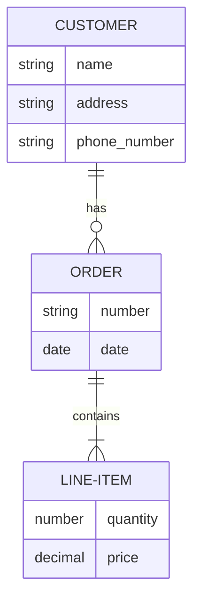
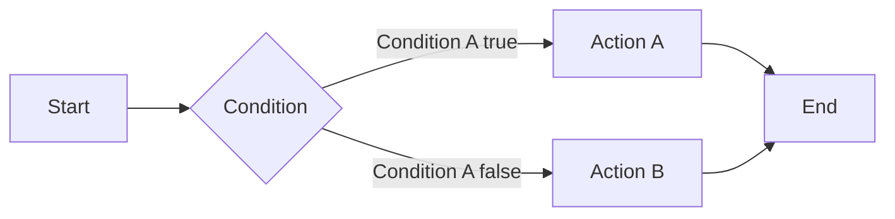
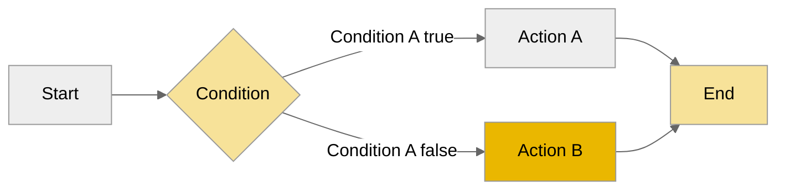

# How to Draw Diagrams in Markdown Documents with Mermaid
::tags{Web Development, mermaid, markdown, VSCode}::

---

This article is about how to draw diagrams in markdown files using text.  
The diagrams are created using a notation called mermaid.  
It's pretty convenient as it can also be output in HTML format, and I use it for work too.

## What You Will Learn in This Article
You will learn the overview, benefits, and usage (with examples) of mermaid.
- Overview of mermaid
    - Notation for drawing diagrams with text in markdown files
    - Simple notation allows for various diagrams
    - Very user-friendly in many aspects
    - Can be output in HTML format with VSCode

- Basics of how to draw each type of diagram
- How to change colors (other display styles can also be changed)
- Specific methods for using mermaid in VSCode

## What is mermaid?
Mermaid is a tool for drawing diagrams and charts using text. It has the following features:
- Simple notation
    - Mermaid notation is simple and intuitive
    - Anyone can start using it without specialized graphics skills

- Plain text format
    - Can be edited with a regular text editor, making it highly compatible
    - Easy to manage versions
- Can draw various types of diagrams
    - Flowcharts, sequence diagrams, Gantt charts, ER diagrams, etc.
    - Commands to change colors and other features can be included
- Automatic layout
    - Automatically adjusts the layout of the diagram
    - Saves the trouble of manually adjusting the layout, allowing you to focus on the content you want to express
- Free

## What Are the Basics of Drawing?
Let's write simple diagrams and their underlying text.  
Besides these, I think you can also draw customer journeys.

### Flowchart
Nested elements are okay.  
Additionally, you can change the flow direction by specifying `LR` or `TB` after `graph`.

```Python
graph TD;
    A[Start] --> B{Condition};
    B -->|Condition A true| C[Action A];
    B -->|Condition A false| D[Action B];
    C --> E[End];
    D --> E;
```
```mermaid
graph TD;
    A[Start] --> B[Action A];
    B --> C;
    B --> D;
    D --> E[End];
    subgraph D[Action C]
        Action C-1--> Action C-2;
    end
    subgraph C[Action B]
        Action B-1--> Action B-2;
    end
    Action B-2--> Action C-1;
```
```Python
graph TD;
    A[Start] --> B[Action A];
    B --> C;
    B --> D;
    D --> E[End];
    subgraph D[Action C]
        Action C-1--> Action C-2;
    end
    subgraph C[Action B]
        Action B-1--> Action B-2;
    end
    Action B-2--> Action C-1;
```
### Sequence Diagram
You can add comments with `note`, and also represent arrow shapes and execution states.

```Python
sequenceDiagram
    actor User
    participant Client
    participant Server
    User ->>+ Client: Send Request
    Client ->>+ Server: Process Request
    note right of Server: hoge
    Server --)- Client: Send Response
    Client --)- User: Receive Response
```
### Gantt Chart

```Python
gantt
    title Example of a Gantt Chart
    dateFormat  YYYY-MM-DD
    section Task 1
    Task 1's Task 1 :done, 2024-04-10, 2024-04-15
    Task 1's Task 2 :done, 2024-04-15, 2024-04-20
    section Task 2
    Task 2's Task 1 :done, 2024-04-18, 2024-04-22
    Task 2's Task 2 :done, 2024-04-23, 2024-04-25
```

### ER Diagram

```Python
erDiagram
    CUSTOMER ||--o{ ORDER : has
    ORDER ||--|{ LINE-ITEM : contains
    CUSTOMER {
        string name
        string address
        string phone_number
    }
    ORDER {
        string number
        date    date
    }
    LINE-ITEM {
        number quantity
        decimal price
    }
```

## Can You Change Colors? → Yes
You can change theme and shape colors like this.  
Of course, for more detailed information, you can check out various sites, starting with [Junkawa's page](https://zenn.dev/junkawa/articles/zenn-mermaidjs-theme-config).

### Before Changing

```Python
graph LR;
    A[Start] --> B{Condition};
    B -->|Condition A true| C[Action A];
    B -->|Condition A false| D[Action B];
    C --> E[End];
    D --> E;
```
### After Changing

```Python
%%{init: {'theme':'neutral'}}%%
graph LR;
    classDef c1 fill:#eab700,fill-opacity:0.4
    classDef c2 fill:#eab700,fill-opacity:1
    A[Start] --> B{Condition}:::c1;
    B -->|Condition A true| C[Action A];
    B -->|Condition A false| D[Action B]:::c2;
    C --> E[End]:::c1;
    D --> E;
```

## Specific Methods for Using mermaid in VSCode
You can preview and output using the initial settings and operation methods described in [How to Convert Markdown to HTML in VSCode](../posts_en/2024-04-19-markdown2html.html).

## Summary
I introduced the mermaid notation for drawing diagrams with text in markdown files.  
It's pretty convenient, and I use it for work, so please give it a try!